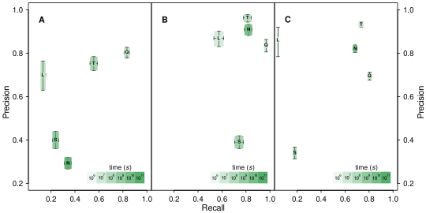

# QUAESITOR
*QUAESITOR* locates Latin scientific names in Chinese, Czech, Danish, Dutch, English, French, German, Italian, Japanese, Latin, Norwegian, Polish, Portuguese, Russian, Spanish, and Swedish text (approximately 96% of biodiversity titles). It uses a combination of pattern matching (regular expressions), a Bloom filter, and a trio of complementary ensembled neural networks. A [live version](https://www.nybg.org/files/scientists/dlittle/quaesitor-web/) of the web interface is hosted at the New York Botanical Garden.

<table>
	<tr>
		<td width="40%"></td>
		<td></td>
	</tr><tr>
		<td width="40%"><sub>Fig. 1. Precision–recall curves for all possible cutoff values calculated from validation data (5% of the total dataset). A 5% random error was added to the inherent BF error rate to mimic the effect of missing entries thereby depressing the BF, uEDFFNN, and bEDFFNN curves. The binominal (bEDFFNN) and uninominal (uEDFFNN) ensemble classifiers perform better than any of the input classifiers demonstrating complementarity.</sub></td>
		<td><sub>Fig. 2. Precision versus recall for (A) A100, (B) S800, and (C) COPIOUS datasets using LINNAEUS (L), NETINETI (N), QUAESITOR (Q), SPECIES (S), and TAXONFINDER (T). Error bars indicate 99% confidence intervals. Confidence area opacity indicates relative processing time on a log scale with darker colors indicating slower programs.</sub><td>
	</tr>
</table>

### install
`npm install quaesitor --save`

### use (node)
```javascript
import * as path from 'path';
import { Classifiers, Quaesitor } from 'quaesitor';
const c = new Classifiers();
const p = path.dirname(require.resolve('quaesitor/package.json')) + '/dist/assets/';
c.bf = fs.readFileSync(p + 'bf.pbf');
c.bedffnn = fs.readFileSync(p + 'bedffnn.pbf');
c.ecnn = fs.readFileSync(p + 'ecnn.pbf');
c.lcnn = fs.readFileSync(p + 'lcnn.pbf');
c.pdffnn = fs.readFileSync(p + 'pdffnn.pbf');
c.uedffnn = fs.readFileSync(p + 'uedffnn.pbf');
const q = new Quaesitor();
await q.loadClassifiers(c);
const html = false;
console.log(await q.extractSpecies('Text with one or more Latin Scientific names, such as Cupressus sempervirens L., embedded within it.', html));
```

### use (web)
Use the [quaesitor.service](https://github.com/dpl10/quaesitor-web/blob/master/src/app/quaesitor.service.ts) in your own Angular project, see an implementation example in [quaesitor.component](https://github.com/dpl10/quaesitor-web/blob/master/src/app/quaesitor/quaesitor.component.ts).

### citation
If you use this software, please cite: Little, D.P. 2020. Recognition of Latin scientific names using artificial neural networks. [Applications in Plant Sciences 8(7): e11378.](https://doi.org/10.1002/aps3.11378)

### license
[MIT](https://github.com/dpl10/quaesitor/blob/master/LICENSE)

### related repositories
* [quaesitor-cli](https://github.com/dpl10/quaesitor-cli)
* [quaesitor-web](https://github.com/dpl10/quaesitor-web)
